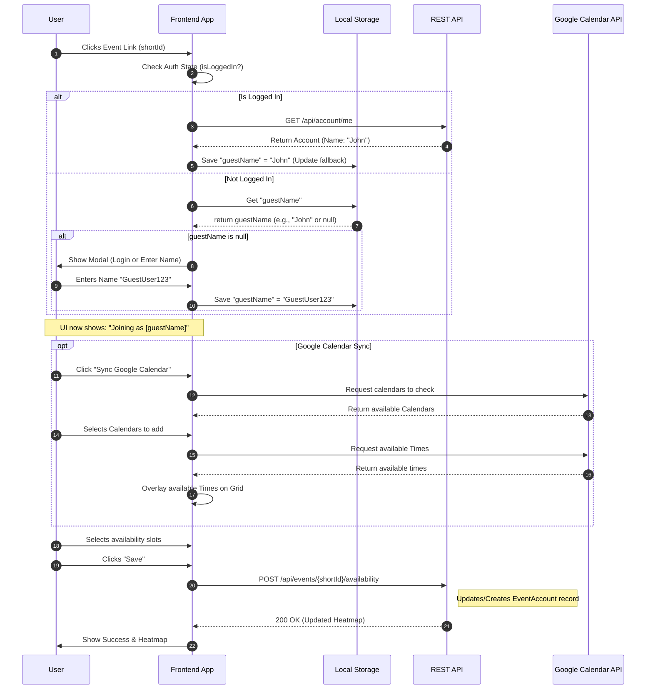
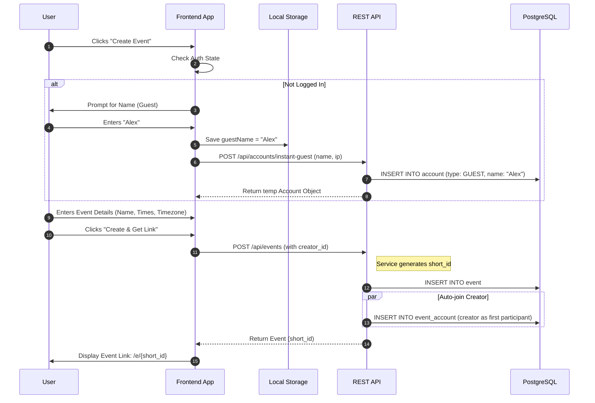

# Gatherr 1.0

## High-level description

Gatherr is a SaaS platform designed to solve the "when are we all free?" problem. It allows users to create events, propose multiple time slots, and visualize group availability through an aggregated heatmap. Unlike rigid calendar tools, Gatherr emphasizes a "low-friction" entry, allowing guests to participate without mandatory account creation.

## High-level steps

<!-- What are the main steps of the project? What tasks and in what

order are carried out? These should be each 10-30h of work. -->

1. Project Setup & MVP Infrastructure: Initializing the Spring Boot backend, setting up the PostgreSQL schema with JSONB support, and configuring the React/Next.js frontend with Tailwind and basic routing.
2. Core API & Event Flow: Implementing the "Instant Guest" logic and the CRUD operations for Events. Generating short_id and managing the event_account relationship.
3. The Interactive Heatmap (FE): Developing the availability grid. This includes the "drag-to-select" UI and the logic to aggregate multiple JSONB availability blobs into a single visual heatmap.
4. Google Calendar Integration: Implementing OAuth2 flow, fetching calendarList, and building the logic to overlay "Busy" blocks onto the Gatherr grid.

## Scopes

### Scope 1: The Core (Deadline: 04.04)

*Focus: User flow, identity persistence, and basic database interaction.*

* **Instant Identity:** Implementation of the "Guest" account creation and Local Storage persistence.
* **Event Lifecycle:** Ability to create an event, generate a `short_id`, and share the link.
* **Basic Submission:** The grid UI allows a user to click slots and save them to the database.
* **Initial API:** All CRUD endpoints for `Account` and `Event` are functional.
* **Design Implementation:** High-fidelity conversion of the Figma design into FE.
* **Aggregated Heatmap:** Logic to fetch all participant data and calculate the visual "density" for the group view.
* **Multi Language Support:** FE structure to enable multi languge application

### Scope 2: The Platform (Deadline: 03.05)

*Focus: Deployment, App, Ads, Third-party integrations, and user settings.*

* **Google Calendar Sync:** Full OAuth2 flow, fetching `calendarList` and available calendar times.
* **User Preferences:** Implementation of timezone detection and toggleable settings (24h clock, Monday-start, support estonian language).
* **App:** Simple expo webview app for mobile.
* **Ads:** Google Ads are implemented.
* **Subscription:** User can subscribe or buy lifetime package for features.
* **Deployment:** Moving from local development to a live production environment.

---

### Views and design

[Figma design](https://www.figma.com/design/Qal5WkR5TMyEXpqycciRwa/Gatherr?node-id=0-1&t=g1ZWyYb3fhPwprDR-1)

### User stories ordered by importance

#### 1. Event Creation (Organizer Flow)

##### Story: Instant Guest Creation

> **As an** unauthenticated user,
> **I want** the system to automatically create a guest profile for me when I provide my name,
> **So that** I can create an event immediately without going through a full registration process.
>
> * **Acceptance Criteria:**
> * System checks for "guestName" in local storage.
> * If missing, a modal prompts for a name.
> * A record is created in the `account` table with type `GUEST`.
> * The IP address is captured for the guest account.
>
>
>
>

##### Story: Event Initialization

> **As a** creator (Guest or User),
> **I want** to define the name, description, and potential time slots for an event,
> **So that** I can share a specific link with my group.
>
> * **Acceptance Criteria:**
> * System generates a unique `short_id` for the event URL.
> * The event is linked to the creator's account ID.
> * The creator is automatically added to the `event_account` table as the first participant.
>
>
>
>

---

#### 2. Event Joining (Participant Flow)

##### Story: Seamless Identity Persistence

> **As a** returning guest,
> **I want** the system to remember my name from local storage when I click an event link,
> **So that** I don't have to re-enter my name every time I join a new event.
>
> * **Acceptance Criteria:**
> * FE checks Local Storage for `guestName`.
> * If the user is logged in, their `Account` name updates the local `guestName` to keep them in sync.
>
>
>
>

##### Story: Availability Submission

> **As a** participant,
> **I want** to select my available time slots on a grid and save them,
> **So that** the organizer can see when I am free.
>
> * **Acceptance Criteria:**
> * Availability is sent as a JSON list to the `POST /api/events/{shortId}/availability` endpoint.
> * The `event_account` record is updated or created.
> * The heatmap refreshes to show the updated group availability.
>
>
>
>

---

#### 3. Technical / System Stories

##### Story: Real-time Heatmap Visibility

> **As a** participant,
> **I want** the event heatmap to update for everyone once I save my times,
> **So that** the group can reach a consensus in real-time.
>
> * **Acceptance Criteria:**
> * The backend(or maybe FE not sure yet) must aggregate all `event_account` JSONB records for a specific `event_id`.
> * The API returns a count of participants per time slot.
>
>
>
>

---

#### 4. Calendar Selection

##### Story: Calendar Discovery

> **As a** user with multiple calendars,
> **I want** to see a list of my Google Calendars after authenticating,
> **So that** I can choose exactly which schedules should affect my availability for this event.
>
> * **Acceptance Criteria:**
> * FE calls Google `calendarList.list` endpoint.
> * A selection interface (checkboxes) appears for all returned calendars.
> * Primary calendar is selected by default.
>
>
>
>

##### Story: Smart Time Overlay

> **As a** participant,
> **I want** the system to fetch busy data only from my selected calendars,
> **So that** my availability grid is pre-populated with my actual free time.
>
> * **Acceptance Criteria:**
> * System uses Google API for the specific selected IDs.
> * The FE grid marks all available times
>
>
>
>

---

### Functionalities

#### 1. Low-Friction Entry (The "Guest" System)

* **Instant Identity:** Users can create an event or join one by simply providing a name. The system persists this "Guest" identity via Local Storage and IP tracking to avoid the need for immediate email/password registration.
* **Session Persistence:** Returning guests are automatically recognized on the same device, keeping their name and previous events accessible.

#### 2. Event Management

* **Event Creation:** Organizers can define a name, description, and a set of proposed dates/times using a drag-and-drop interface.
* **Short Link Generation:** Unique, human-readable `short_id` URLs are generated for easy sharing across social platforms.
* **Timezone Auto-Detection:** The system automatically detects the creator's and participant's timezones to ensure time slots are displayed correctly for everyone, regardless of location.

#### 3. Availability & Consensus

* **Interactive Availability Grid:** A "paintable" grid where users can click or drag to mark their free time.
* **The Global Heatmap:** An aggregated view that layers every participant's availability. The "hottest" (darkest) areas of the grid indicate the times when most people are free.
* **Participant List:** A sidebar or tooltip view showing exactly who is available for a specific time slot when hovering over the heatmap or clicking on mobile.

#### 4. Smart Integrations (Scope 2)

* **Google Calendar Sync:** Users can connect their Google account to overlay their "Busy" events directly onto the Gatherr grid, preventing them from accidentally proposing times they are already booked.

#### 5. User Preferences & Localization

* **Clock Format Toggles:** Support for both 12-hour (AM/PM) and 24-hour time formats.
* **Week Start Customization:** Option to start the calendar view on Sunday or Monday based on regional preference.

---

### Integrations

1. **Google Calendar API (OAuth2):** * Used for the "Smart Time Overlay."

* Requires `calendar.readonly` and `calendar.events.public.readonly` scopes.
* Enables the application to fetch "busy" blocks without storing user calendar data permanently.

1. **Stripe API:**

* Essential for managing the `SubscriptionTier` (Pro/Lifetime).
* Handles webhooks to update `subscription_active_until` and `payment_customer_id` in the `Account` table.

1. **IP Geolocation API (e.g., ipapi.co or similar):**

* Used during "Instant Guest" creation to automatically detect the user's timezone.
* Ensures that when a user joins, the grid is already aligned to their local time without manual configuration.

1. **Browser Local Storage:**

* A "soft" integration used to persist the `guestName` and `short_id` history, allowing users to find their created events again without an account.

### Non-functional requirements

1. **Mobile-First Responsiveness:** * Since event links are primarily shared via mobile messaging apps (WhatsApp, Slack, Discord), the availability grid must be fully functional and "touch-friendly" on screens as small as 360px wide.
2. **Data Integrity (JSONB Validation):** * The system must validate the structure of the `availability` JSONB blobs before saving to prevent corrupted grid states.
3. **High Availability:** * Targeting **99.9% uptime** during the initial launch phase, as group coordination is time-sensitive and outages during "planning peaks" (like Friday afternoons) are critical.
4. **Privacy & Minimal Data Collection:** * Guest accounts should only store necessary technical metadata (IP, Name). No PII (Personally Identifiable Information) beyond an optional email for "Pro" users should be required. Events will be deleted after 3 months of creation

---

## Timeline

| Milestone | Date | Deliverables |
| --- | --- | --- |
| **Project Start** | 09.03 | Repo init, DB schema migration, Boilerplate. |
| **Scope 1 Ready** | 04.04 | **MVP:** Create event -> Share link -> Save manual slots. |
| **Initial Demo** | 07.04 | Video presentation showing the core "low-friction" flow. |
| **Scope 2 Ready** | 03.05 | **Full v1.0:** Heatmap + Google Sync + Final Polish. |
| **Final Demo** | 04.05 | Final demo video. |

---

## Cost calculations

<!-- How long this project takes (in hours) to complete? Based on

the hourly rate, how much does the project cost? Are there any other

project-related costs that we are aware of? -->

* Total Estimated Hours: ~120–150 hours.
* Infrastructure Costs: Minimal (PostgreSQL, Spring Boot on AWS).

### Sequence diagrams

#### Joining event



##### Creating event



### Spring boot models

* models

```text
com.gatherr
├── model/    
│   ├── Account.java
│   ├── Event.java
│   └── EventAccount.java
├── model/enums/ 
│   ├── AccountType.java
│   └── SubscriptionTier.java
```

* src/main/java/com/gatherr/model/enums/AccountType.java

```java
package com.gatherr.model.enums;

public enum AccountType { GUEST, USER }
```

* src/main/java/com/gatherr/model/enums/SubscriptionTier.java

```java
package com.gatherr.model.enums;

public enum SubscriptionTier { FREE, PRO, LIFETIME }
```

* src/main/java/com/gatherr/model/Account.java

```java
package com.gatherr.model;

import com.gatherr.model.enums.AccountType;
import com.gatherr.model.enums.SubscriptionTier;
import jakarta.persistence.*;
import lombok.*;
import org.hibernate.annotations.CreationTimestamp;
import org.hibernate.annotations.UpdateTimestamp;

import java.time.OffsetDateTime;

@Entity
@Table(name = "account")
@Getter @Setter
@NoArgsConstructor
@AllArgsConstructor
@Builder
public class Account {

    @Id
    @GeneratedValue(strategy = GenerationType.IDENTITY)
    private Long id;

    @Column(nullable = false)
    private String name;

    @Column(unique = true)
    private String email;

    private String password;

    @Column(name = "ip_address", columnDefinition = "inet", nullable = false)
    private String ipAddress;

    @Enumerated(EnumType.STRING)
    @Column(nullable = false)
    private AccountType type;

    private String timezone;

    @Builder.Default
    @Column(name = "start_on_monday", nullable = false)
    private boolean startOnMonday = true;

    @Builder.Default
    @Column(name = "time_format_24", nullable = false)
    private boolean timeFormat24 = true;

    @Column(name = "payment_customer_id")
    private String paymentCustomerId;

    @Enumerated(EnumType.STRING)
    @Builder.Default
    @Column(name = "subscription_tier", nullable = false)
    private SubscriptionTier subscriptionTier = SubscriptionTier.FREE;

    @Column(name = "subscription_active_until")
    private OffsetDateTime subscriptionActiveUntil;

    @Builder.Default
    @Column(nullable = false)
    private String language = "EN";

    @CreationTimestamp
    @Column(name = "created_at", updatable = false)
    private OffsetDateTime createdAt;

    @UpdateTimestamp
    @Column(name = "updated_at")
    private OffsetDateTime updatedAt;
}
```

* src/main/java/com/gatherr/model/Event.java

```java
package com.gatherr.model;

import jakarta.persistence.*;
import lombok.*;
import org.hibernate.annotations.CreationTimestamp;
import org.hibernate.annotations.JdbcTypeCode;
import org.hibernate.annotations.UpdateTimestamp;
import org.hibernate.type.SqlTypes;

import java.time.OffsetDateTime;
import java.util.List;

@Entity
@Table(name = "event")
@Getter @Setter
@NoArgsConstructor
@AllArgsConstructor
@Builder
public class Event {

    @Id
    @GeneratedValue(strategy = GenerationType.IDENTITY)
    private Long id;

    @Column(nullable = false)
    private String name;

    @Column(columnDefinition = "text")
    private String description;

    @Column(name = "short_id", unique = true, nullable = false)
    private String shortId;

    @ManyToOne(fetch = FetchType.LAZY)
    @JoinColumn(name = "creator_id", nullable = false)
    private Account creator;

    @JdbcTypeCode(SqlTypes.JSON)
    @Column(columnDefinition = "jsonb", nullable = false)
    private List<String> times; 

    private String timezone;

    @Builder.Default
    @Column(name = "is_deleted", nullable = false)
    private boolean isDeleted = false;

    @CreationTimestamp
    private OffsetDateTime createdAt;

    @UpdateTimestamp
    private OffsetDateTime updatedAt;
}
```

* src/main/java/com/gatherr/model/Account.java

```java
package com.gatherr.model;

import jakarta.persistence.*;
import lombok.*;
import org.hibernate.annotations.CreationTimestamp;
import org.hibernate.annotations.JdbcTypeCode;
import org.hibernate.annotations.UpdateTimestamp;
import org.hibernate.type.SqlTypes;

import java.time.OffsetDateTime;
import java.util.List;

@Entity
@Table(name = "event_account", 
       uniqueConstraints = @UniqueConstraint(columnNames = {"event_id", "account_id"}))
@Getter @Setter
@NoArgsConstructor
@AllArgsConstructor
@Builder
public class EventAccount {

    @Id
    @GeneratedValue(strategy = GenerationType.IDENTITY)
    private Long id;

    @ManyToOne(fetch = FetchType.LAZY)
    @JoinColumn(name = "event_id", nullable = false)
    private Event event;

    @ManyToOne(fetch = FetchType.LAZY)
    @JoinColumn(name = "account_id", nullable = false)
    private Account account;

    @JdbcTypeCode(SqlTypes.JSON)
    @Column(columnDefinition = "jsonb", nullable = false)
    private List<String> availability;

    @CreationTimestamp
    private OffsetDateTime createdAt;

    @UpdateTimestamp
    private OffsetDateTime updatedAt;
}
```

### Database schema

* [draw sql](https://drawsql.app/teams/gatherr/diagrams/gatherr)

```sql
CREATE TABLE account (
    id BIGINT GENERATED ALWAYS AS IDENTITY PRIMARY KEY,
    name VARCHAR(255) NOT NULL,
    email VARCHAR(255) UNIQUE NULL,
    password VARCHAR(255) NULL,
    ip_address INET NOT NULL,
    type VARCHAR(255) CHECK (type IN ('GUEST', 'USER')) NOT NULL,
    timezone VARCHAR(255) NOT NULL,
    start_on_monday BOOLEAN NOT NULL DEFAULT TRUE,
    time_format_24 BOOLEAN NOT NULL DEFAULT TRUE,
    payment_customer_id VARCHAR(255) NULL,
    subscription_tier VARCHAR(255) CHECK (subscription_tier IN ('FREE', 'PRO', 'LIFETIME')) NOT NULL DEFAULT 'FREE',
    subscription_active_until TIMESTAMPTZ NULL,
    language VARCHAR(255) NOT NULL DEFAULT 'EN',
    created_at TIMESTAMPTZ NOT NULL DEFAULT CURRENT_TIMESTAMP,
    updated_at TIMESTAMPTZ NOT NULL DEFAULT CURRENT_TIMESTAMP
);

CREATE UNIQUE INDEX idx_account_email_lower ON account (LOWER(email));

CREATE TABLE event (
    id BIGINT GENERATED ALWAYS AS IDENTITY PRIMARY KEY,
    name VARCHAR(255) NOT NULL,
    description TEXT NULL,
    short_id VARCHAR(255) UNIQUE NOT NULL,
    creator_id BIGINT NOT NULL,
    times JSONB NOT NULL,
    timezone VARCHAR(255) NOT NULL,
    is_deleted BOOLEAN NOT NULL DEFAULT FALSE,
    created_at TIMESTAMPTZ NOT NULL DEFAULT CURRENT_TIMESTAMP,
    updated_at TIMESTAMPTZ NOT NULL DEFAULT CURRENT_TIMESTAMP,
    CONSTRAINT event_creator_id_foreign FOREIGN KEY(creator_id) REFERENCES account(id) ON DELETE CASCADE
);

CREATE TABLE event_account (
    id BIGINT GENERATED ALWAYS AS IDENTITY PRIMARY KEY,
    event_id BIGINT NOT NULL,
    account_id BIGINT NOT NULL,
    availability JSONB NOT NULL,
    created_at TIMESTAMPTZ NOT NULL DEFAULT CURRENT_TIMESTAMP,
    updated_at TIMESTAMPTZ NOT NULL DEFAULT CURRENT_TIMESTAMP,
    CONSTRAINT event_account_unique UNIQUE(event_id, account_id),
    CONSTRAINT event_account_account_foreign FOREIGN KEY(account_id) REFERENCES account(id) ON DELETE CASCADE,
    CONSTRAINT event_account_event_foreign FOREIGN KEY(event_id) REFERENCES event(id) ON DELETE CASCADE
);

CREATE INDEX idx_event_short_id ON event(short_id);
CREATE INDEX idx_event_creator_id ON event(creator_id); 
CREATE INDEX idx_availability_heatmap ON event_account USING GIN (availability);
```
