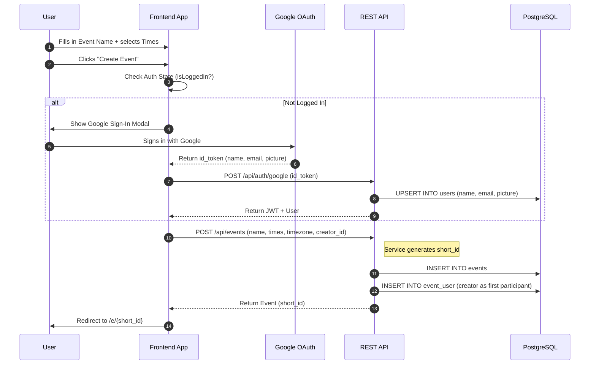
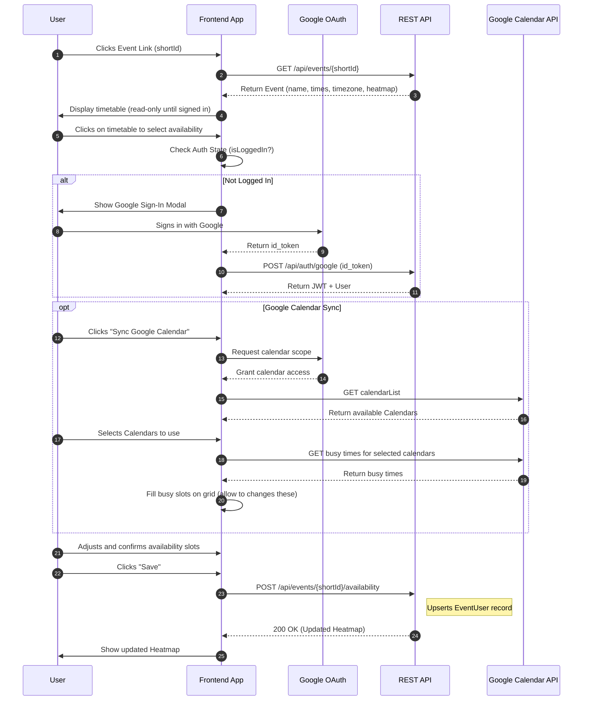
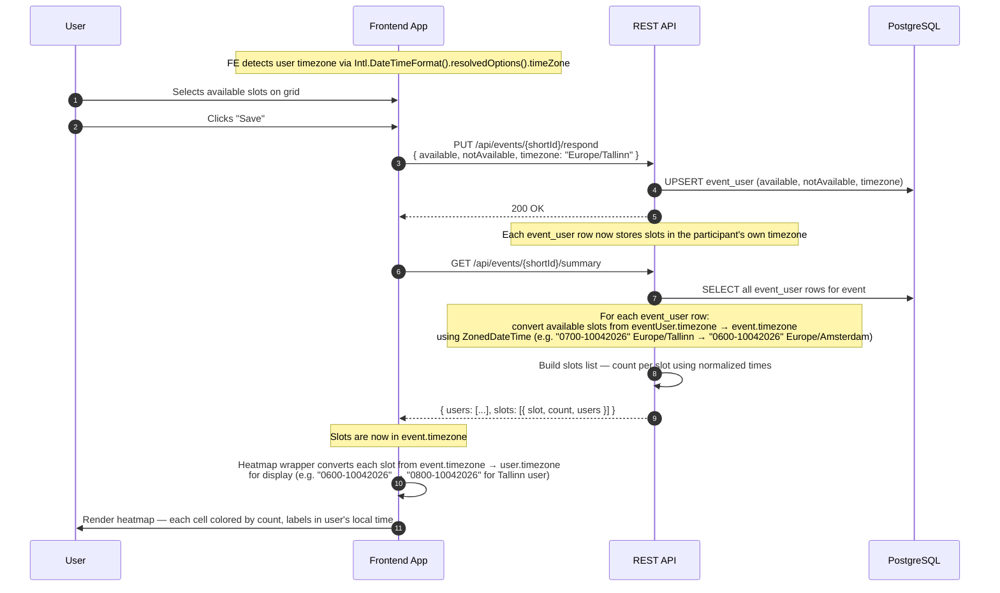

# Gatherr 1.0

## Table of Contents

- [High-level description](#high-level-description)
- [High-level steps](#high-level-steps)
- [Scopes](#scopes)
- [Views and design](#views-and-design)
- [User stories](#user-stories-ordered-by-importance)
- [Functionalities](#functionalities)
- [Integrations](#integrations)
- [Non-functional requirements](#non-functional-requirements)
- [Timeline](#timeline)
- [Cost calculations](#cost-calculations)
- [Sequence diagrams](#sequence-diagrams)
- [REST API Mapping](#rest-api-mapping)
- [Spring boot models](#spring-boot-models)
- [Database schema](#database-schema)
- [Liquibase schema](#liquibase-schema)
- [Changelog](#changelog)

---

## High-level description

Gatherr is a SaaS platform designed to solve the "when are we all free?" problem. It allows users to create events, propose multiple time slots, and visualize group availability through an aggregated heatmap.

## High-level steps

<!-- What are the main steps of the project? What tasks and in what

order are carried out? These should be each 10-30h of work. -->

1. Project Setup & MVP Infrastructure: Initializing the Spring Boot backend, setting up the PostgreSQL schema with JSONB support, and configuring the React frontend with Tailwind and basic routing.
2. Core API & Event Flow: Implementing Google OAuth2 sign-in and the CRUD operations for Events. Generating short_id and managing the event_user relationship.
3. The Interactive Heatmap (FE): Developing the availability grid. This includes the "drag-to-select" UI and the logic to aggregate multiple JSONB availability blobs into a single visual heatmap.
4. Google Calendar Integration: Requesting users calendar info post-login, fetching calendarList, and building the logic to overlay busy blocks onto the Gatherr grid.

## Scopes

### Scope 1: The Core (Deadline: 04.04)

*Focus: Google auth, event flow, and basic database interaction.*

* **Google Sign-In:** Implementation of Google OAuth2 for all users (creators and participants).
* **Basic Submission:** The grid UI allows a user to click slots and save them to the database.
* **Initial API:** All CRUD endpoints for `User` and `Event` are functional.
* **Design Implementation:** Implementing the Figma design in the frontend
* **Event Lifecycle:** Ability to create an event, generate a `short_id`, and share the link.
* **Aggregated Heatmap:** Logic to fetch all participant data and calculate the visual "density" for the group view.
* **Multi Language Support:** FE structure to enable multi language application

### Scope 2: The Platform (Deadline: 03.05)

*Focus: Deployment, App, Ads, and third-party integrations.*

* **Google Calendar Sync:** Fetching `calendarList` and busy calendar times.
* **Email notifications:** Send notifications about event times to users and allow them to add the time to google calendar with one button click.
* **User Preferences:** Implementation of timezone detection and toggleable settings (24h clock, Monday-start, support estonian language).
* **Deployment:** Moving from local development to a live production environment.
* **App:** Simple expo webview app for mobile.

---

## Views and design

[Figma design](https://www.figma.com/design/Qal5WkR5TMyEXpqycciRwa/Gatherr?node-id=69-769&p=f&t=f4oHycjedvlD1cTR-0)

## User stories ordered by importance

### 1. Event Creation (Organizer Flow)

#### Story: Event Initialization

> **As a** user,
> **I want** to define the name and potential time slots for an event and then sign in with Google,
> **So that** I can share a specific link of the event with my group.
>
> * **Acceptance Criteria:**
> * User fills in event name and selects time slots on the creation screen.
> * Clicking "Create Event" triggers the Google Sign-In modal if not already authenticated.
> * After successful sign-in, the event is created and linked to the authenticated user.
> * System generates a unique `short_id` for the event URL.
> * The creator is automatically added to the `event_user` table as the first participant.
>
>
>
>

---

### 2. Event Joining (Participant Flow)

#### Story: Availability Submission

> **As a** participant,
> **I want** to select my available time slots on a grid and save them,
> **So that** the other users can see when I am free.
>
> * **Acceptance Criteria:**
> * Clicking on the timetable triggers the Google Sign-In modal if not already authenticated.
> * Availability is sent as a JSON list to the `POST /api/events/{shortId}/available` endpoint.
> * The `event_user` record is updated or created.
> * The heatmap refreshes to show the updated group availability.
>
>
>
>

---

### 3. Technical / System Stories

#### Story: Real-time Heatmap Visibility

> **As a** participant,
> **I want** the event heatmap to update for everyone once I save my times,
> **So that** the group can reach a consensus in real-time.
>
> * **Acceptance Criteria:**
> * The backend must aggregate all `event_user` JSONB records for a specific `event_id`.
> * The API returns a count of participants per time slot.
>
>
>
>

---

### 4. Calendar Selection

#### Story: Calendar Discovery

> **As a** user with multiple calendars,
> **I want** to see a list of my Google Calendars after granting calendar access,
> **So that** I can choose exactly which schedules should affect my availability for this event.
>
> * **Acceptance Criteria:**
> * FE requests calendar scope and calls Google `calendarList.list` endpoint.
> * A selection interface (checkboxes) appears for all returned calendars.
> * Primary calendar is selected by default.
>
>
>
>

#### Story: Smart Time Overlay

> **As a** participant,
> **I want** the system to fetch busy data only from my selected calendars,
> **So that** my availability grid is pre-populated with all the "busy" times. But i must be able to overwrite these busy times.
>
> * **Acceptance Criteria:**
> * User gets available calendars
> * Then selects calendars and gets busy times
> * The FE grid marks all busy times.
>
>
>
>

---

## Functionalities

### 1. Google Sign-In

* **Single Auth Provider:** All users — creators and participants — sign in with Google. No passwords, no email verification, no guest users.
* **Deferred Auth:** Users can browse the event creation screen and the event timetable before being prompted to sign in, reducing perceived friction.

### 2. Event Management

* **Event Creation:** Organizers can define a name, description, and a set of proposed dates/times using a drag-and-drop interface.
* **Short Link Generation:** Unique, human-readable `short_id` URLs are generated for easy sharing across social platforms.
* **Timezone Auto-Detection:** The system automatically detects the creator's and participant's timezones to ensure time slots are displayed correctly for everyone, regardless of location.

### 3. Availability & Consensus

* **Interactive Availability Grid:** A "paintable" grid where users can click or drag to mark their free time.
* **The Global Heatmap:** An aggregated view that layers every participant's availability. The "hottest" (darkest) areas of the grid indicate the times when most people are free.
* **Participant List:** A sidebar or tooltip view showing exactly who is available for a specific time slot when hovering over the heatmap or pressing on mobile devices.

### 4. Smart Integrations (Scope 2)

* **Google Calendar Sync:** Users can grant calendar access to overlay their "Busy" events directly onto the Gatherr grid, preventing them from accidentally proposing times they are already booked.
* **Email notifications:** Users can get emails of when event is happening and add the event to their calendar with one click.

### 5. User Preferences & Localization (Scope 2)

* **Clock Format Toggles:** Support for both 12-hour (AM/PM) and 24-hour time formats.
* **Week Start Customization:** Option to start the calendar view on Sunday or Monday based on regional preference.

---

## Integrations

1. **Google OAuth2 (Sign-In):**

* Used for all authentication — creators and participants.
* Scopes at sign-in: `openid`, `profile`, `email`.
* No passwords or guest users needed.

1. **Google Calendar API (OAuth2):**

* Used for the "Smart Time Overlay".
* `calendar.readonly` and `calendar.events.public.readonly`.
* Enables the application to fetch "busy" blocks without storing user calendar data permanently.

## Non-functional requirements

1. **Mobile-First Responsiveness:** Since event links are primarily shared via mobile messaging apps (WhatsApp, Slack, Discord), the availability grid must be fully functional and "touch-friendly" on screens as small as 360px wide. As on rival products this heatmap touching has really bad UX.
2. **Data Integrity (JSONB Validation):** The system must validate the structure of the `availability` JSONB blobs before saving to prevent corrupted grid states.
3. **High Availability:** Targeting **99.9% uptime** during the initial launch phase, as group coordination is time-sensitive and outages during "planning peaks" (like Friday afternoons) are critical.
4. **Privacy & Minimal Data Collection:** Only Google profile data (name, email, picture) is stored. No passwords or IP addresses are collected. Events will be deleted after 3 months of creation.

---

## Timeline

| Milestone | Date | Deliverables |
| --- | --- | --- |
| **Project Start** | 09.03 | Repo init, DB schema migration, Boilerplate. |
| **Scope 1 Ready** | 04.04 | **MVP:** Create event -> Share link -> Save manual slots. |
| **Initial Demo** | 07.04 | Video presentation showing the core flow. |
| **Scope 2 Ready** | 03.05 | **Full v1.0:** Heatmap + Google Sync + Final Polish. |
| **Final Demo** | 04.05 | Final demo video. |

---

## Cost calculations

<!-- How long this project takes (in hours) to complete? Based on

the hourly rate, how much does the project cost? Are there any other

project-related costs that we are aware of? -->

- Total Estimated Hours: ~120–150 hours.
- Infrastructure Costs: Minimal (PostgreSQL, Spring Boot on AWS).

## Sequence diagrams

### Creating event



### Joining event



### Timezone-aware availability and heatmap



---

## REST API mapping

- Everything starts with /api/v1

SET `server.servlet.context-path=/api/v1` in `application.properties`

| Group | Method | Endpoint | Purpose |
| :--- | :--- | :--- | :--- |
| **Users** | `GET` | `/users/me` | Fetch current user profile & settings |
| **Users** | `PATCH` | `/users/me` | Update user preferences (e.g. timezone) |
| **Events** | `POST` | `/events` | Create a new event and time slots |
| **Events** | `GET` | `/events/{shortId}` | Fetch specific event details |
| **Events** | `GET` | `/events/mine` | List all events created by the user |
| **Events** | `PATCH` | `/events/{shortId}` | Update event (name, description, etc.) |
| **Events** | `DELETE` | `/events/{shortId}` | Soft delete event (`is_deleted = true`) |
| **Availability** | `PUT` | `/events/{shortId}/respond` | Save or overwrite user's availability |
| **Availability** | `GET` | `/events/{shortId}/summary` | Fetch all responses (Heatmap data) |

---

## Spring boot models

- models

```text
com.gatherr
├── model/
│   ├── User.java
│   ├── Event.java
│   └── EventUser.java
├── model/enums/
│   └── EventType.java
```

- src/main/java/com/gatherr/model/enums/EventType.java

```java
package com.gatherr.model.enums;

public enum EventType {
    SPECIFIC_DATES,
    DAYS_OF_THE_WEEK
}
```

- src/main/java/com/gatherr/model/User.java

```java
package com.gatherr.model;

import jakarta.persistence.*;
import lombok.*;
import org.hibernate.annotations.CreationTimestamp;
import org.hibernate.annotations.UpdateTimestamp;

import java.time.OffsetDateTime;

@Entity
@Table(name = "users")
@Getter @Setter
@NoArgsConstructor
@AllArgsConstructor
@Builder
public class User {

    @Id
    @GeneratedValue(strategy = GenerationType.IDENTITY)
    private Long id;

    @Column(nullable = false)
    private String name;

    @Column(unique = true, nullable = false)
    private String email;

    @Column(name = "profile_picture")
    private String profilePicture;

    @Column(nullable = false)
    private String timezone;

    @Builder.Default
    @Column(name = "start_on_monday", nullable = false)
    private boolean startOnMonday = true;

    @Builder.Default
    @Column(name = "time_format_24", nullable = false)
    private boolean timeFormat24 = true;

    @Builder.Default
    @Column(nullable = false)
    private String language = "EN";

    @CreationTimestamp
    @Column(name = "created_at", updatable = false)
    private OffsetDateTime createdAt;

    @UpdateTimestamp
    @Column(name = "updated_at")
    private OffsetDateTime updatedAt;
}
```

* src/main/java/com/gatherr/model/Event.java

```java
package com.gatherr.model;

import jakarta.persistence.*;
import lombok.*;
import org.hibernate.annotations.CreationTimestamp;
import org.hibernate.annotations.JdbcTypeCode;
import org.hibernate.annotations.UpdateTimestamp;
import org.hibernate.type.SqlTypes;

import java.time.OffsetDateTime;
import java.util.List;

@Entity
@Table(name = "events")
@Getter @Setter
@NoArgsConstructor
@AllArgsConstructor
@Builder
public class Event {

    @Id
    @GeneratedValue(strategy = GenerationType.IDENTITY)
    private Long id;

    @Column(nullable = false)
    private String name;

    @Column(columnDefinition = "text")
    private String description;

    @Column(name = "short_id", unique = true, nullable = false)
    private String shortId;

    @ManyToOne(fetch = FetchType.LAZY)
    @JoinColumn(name = "creator_id", nullable = false)
    @org.hibernate.annotations.OnDelete(action = org.hibernate.annotations.OnDeleteAction.CASCADE)
    private User creator;

    @Enumerated(EnumType.STRING)
    @Column(nullable = false)
    private EventType type;

    @JdbcTypeCode(SqlTypes.JSON)
    @Column(columnDefinition = "jsonb", nullable = false)
    private List<String> times;

    @Builder.Default
    @Column(name = "time_increment", nullable = false)
    private int timeIncrement = 30;

    @Column(nullable = false)
    private String timezone;

    @Builder.Default
    @Column(name = "is_deleted", nullable = false)
    private boolean isDeleted = false;

    @CreationTimestamp
    @Column(name = "created_at", updatable = false)
    private OffsetDateTime createdAt;

    @UpdateTimestamp
    @Column(name = "updated_at")
    private OffsetDateTime updatedAt;
}
```

* src/main/java/com/gatherr/model/EventUser.java

```java
package com.gatherr.model;

import jakarta.persistence.*;
import lombok.*;
import org.hibernate.annotations.CreationTimestamp;
import org.hibernate.annotations.JdbcTypeCode;
import org.hibernate.annotations.UpdateTimestamp;
import org.hibernate.type.SqlTypes;

import java.time.OffsetDateTime;
import java.util.List;

@Entity
@Table(name = "event_user",
       uniqueConstraints = @UniqueConstraint(columnNames = {"event_id", "user_id"}))
@Getter @Setter
@NoArgsConstructor
@AllArgsConstructor
@Builder
public class EventUser {

    @Id
    @GeneratedValue(strategy = GenerationType.IDENTITY)
    private Long id;

    @ManyToOne(fetch = FetchType.LAZY)
    @JoinColumn(name = "event_id", nullable = false)
    private Event event;

    @ManyToOne(fetch = FetchType.LAZY)
    @JoinColumn(name = "user_id", nullable = false)
    private User user;

    @JdbcTypeCode(SqlTypes.JSON)
    @Column(columnDefinition = "jsonb", nullable = false)
    private List<String> available;

    @JdbcTypeCode(SqlTypes.JSON)
    @Column(name = "not_available", columnDefinition = "jsonb", nullable = false)
    private List<String> notAvailable;

    @CreationTimestamp
    @Column(name = "created_at", updatable = false)
    private OffsetDateTime createdAt;

    @UpdateTimestamp
    @Column(name = "updated_at")
    private OffsetDateTime updatedAt;
}
```

## Database schema

* [draw sql](https://drawsql.app/teams/gatherr/diagrams/gatherr)

```sql
CREATE TABLE "users" (
    "id"              BIGINT GENERATED BY DEFAULT AS IDENTITY PRIMARY KEY,
    "name"            VARCHAR(255) NOT NULL,
    "email"           VARCHAR(255) NOT NULL,
    "profile_picture" VARCHAR(255) NULL,
    "timezone"        VARCHAR(255) NULL,
    "start_on_monday" BOOLEAN NOT NULL DEFAULT TRUE,
    "time_format_24"  BOOLEAN NOT NULL DEFAULT TRUE,
    "language"        VARCHAR(255) NOT NULL DEFAULT 'EN',
    "created_at"      TIMESTAMPTZ NOT NULL DEFAULT CURRENT_TIMESTAMP,
    "updated_at"      TIMESTAMPTZ NOT NULL DEFAULT CURRENT_TIMESTAMP,
    CONSTRAINT "users_email_unique" UNIQUE ("email")
);

CREATE TABLE "events" (
    "id"          BIGINT GENERATED BY DEFAULT AS IDENTITY PRIMARY KEY,
    "name"        VARCHAR(255) NOT NULL,
    "description" TEXT NULL,
    "short_id"    VARCHAR(255) NOT NULL,
    "creator_id"  BIGINT NOT NULL,
    "type"        VARCHAR(50) NOT NULL,
    "times"           JSONB NOT NULL,
    "time_increment"  INT NOT NULL DEFAULT 30,
    "timezone"        VARCHAR(255) NOT NULL,
    "is_deleted"  BOOLEAN NOT NULL DEFAULT FALSE,
    "created_at"  TIMESTAMPTZ NOT NULL DEFAULT CURRENT_TIMESTAMP,
    "updated_at"  TIMESTAMPTZ NOT NULL DEFAULT CURRENT_TIMESTAMP,
    CONSTRAINT "events_short_id_unique" UNIQUE ("short_id"),
    CONSTRAINT "events_creator_id_foreign" FOREIGN KEY ("creator_id") REFERENCES "users"("id") ON DELETE CASCADE
);

COMMENT ON COLUMN "events"."times" IS '["0700-10032026","0715-10032026","0730-10032026"]';

CREATE TABLE "event_user" (
    "id"            BIGINT GENERATED BY DEFAULT AS IDENTITY PRIMARY KEY,
    "event_id"      BIGINT NOT NULL,
    "user_id"       BIGINT NOT NULL,
    "available"     JSONB NOT NULL,
    "not_available" JSONB NOT NULL,
    "created_at"    TIMESTAMPTZ NOT NULL DEFAULT CURRENT_TIMESTAMP,
    "updated_at"    TIMESTAMPTZ NOT NULL DEFAULT CURRENT_TIMESTAMP,
    CONSTRAINT "event_user_unique" UNIQUE ("event_id", "user_id"),
    CONSTRAINT "event_user_event_foreign" FOREIGN KEY ("event_id") REFERENCES "events"("id") ON DELETE CASCADE,
    CONSTRAINT "event_user_user_foreign" FOREIGN KEY ("user_id") REFERENCES "users"("id") ON DELETE CASCADE
);

COMMENT ON COLUMN "event_user"."available"     IS '["0700-10032026","0715-10032026","0730-10032026"]';
COMMENT ON COLUMN "event_user"."not_available" IS '["0700-10032026","0715-10032026","0730-10032026"]';

CREATE INDEX "events_short_id_index"          ON "events"("short_id");
CREATE INDEX "events_creator_id_index"        ON "events"("creator_id");
CREATE INDEX "event_user_available_gin"   ON "event_user" USING GIN ("available");
```

## Liquibase schema

* Save to path backend/src/main/resources/db/changelog/db.changelog-master.yaml

* This is generated by AI with my SQL.

```yml
databaseChangeLog:
  # 1. USERS TABLE
  - changeSet:
      id: 001-create-users
      author: gatherr
      changes:
        - createTable:
            tableName: users
            columns:
              - column:
                  name: id
                  type: BIGINT
                  autoIncrement: true
                  constraints:
                    primaryKey: true
              - column:
                  name: name
                  type: VARCHAR(255)
                  constraints:
                    nullable: false
              - column:
                  name: email
                  type: VARCHAR(255)
                  constraints:
                    nullable: false
                    unique: true
                    uniqueConstraintName: users_email_unique
              - column:
                  name: profile_picture
                  type: VARCHAR(255)
              - column:
                  name: timezone
                  type: VARCHAR(255)
              - column:
                  name: start_on_monday
                  type: BOOLEAN
                  defaultValueBoolean: true
                  constraints:
                    nullable: false
              - column:
                  name: time_format_24
                  type: BOOLEAN
                  defaultValueBoolean: true
                  constraints:
                    nullable: false
              - column:
                  name: language
                  type: VARCHAR(255)
                  defaultValue: 'EN'
                  constraints:
                    nullable: false
              - column:
                  name: created_at
                  type: TIMESTAMP WITH TIME ZONE
                  defaultValueComputed: CURRENT_TIMESTAMP
                  constraints:
                    nullable: false
              - column:
                  name: updated_at
                  type: TIMESTAMP WITH TIME ZONE
                  defaultValueComputed: CURRENT_TIMESTAMP
                  constraints:
                    nullable: false

  # 2. EVENTS TABLE
  - changeSet:
      id: 002-create-events
      author: gatherr
      changes:
        - createTable:
            tableName: events
            columns:
              - column:
                  name: id
                  type: BIGINT
                  autoIncrement: true
                  constraints:
                    primaryKey: true
              - column:
                  name: name
                  type: VARCHAR(255)
                  constraints:
                    nullable: false
              - column:
                  name: description
                  type: TEXT
              - column:
                  name: short_id
                  type: VARCHAR(255)
                  constraints:
                    nullable: false
                    unique: true
                    uniqueConstraintName: events_short_id_unique
              - column:
                  name: creator_id
                  type: BIGINT
                  constraints:
                    nullable: false
                    foreignKeyName: events_creator_id_foreign
                    references: users(id)
                    deleteCascade: true
              - column:
                  name: type
                  type: VARCHAR(50)
                  constraints:
                    nullable: false
              - column:
                  name: times
                  type: JSONB
                  remarks: '["0700-10032026","0715-10032026","0730-10032026"]'
                  constraints:
                    nullable: false
              - column:
                  name: timezone
                  type: VARCHAR(255)
                  constraints:
                    nullable: false
              - column:
                  name: is_deleted
                  type: BOOLEAN
                  defaultValueBoolean: false
                  constraints:
                    nullable: false
              - column:
                  name: created_at
                  type: TIMESTAMP WITH TIME ZONE
                  defaultValueComputed: CURRENT_TIMESTAMP
                  constraints:
                    nullable: false
              - column:
                  name: updated_at
                  type: TIMESTAMP WITH TIME ZONE
                  defaultValueComputed: CURRENT_TIMESTAMP
                  constraints:
                    nullable: false

  # 3. EVENT_USER TABLE
  - changeSet:
      id: 003-create-event-user
      author: gatherr
      changes:
        - createTable:
            tableName: event_user
            columns:
              - column:
                  name: id
                  type: BIGINT
                  autoIncrement: true
                  constraints:
                    primaryKey: true
              - column:
                  name: event_id
                  type: BIGINT
                  constraints:
                    nullable: false
                    foreignKeyName: event_user_event_foreign
                    references: events(id)
                    deleteCascade: true
              - column:
                  name: user_id
                  type: BIGINT
                  constraints:
                    nullable: false
                    foreignKeyName: event_user_user_foreign
                    references: users(id)
                    deleteCascade: true
              - column:
                  name: available
                  type: JSONB
                  remarks: '["0700-10032026","0715-10032026","0730-10032026"]'
                  constraints:
                    nullable: false
              - column:
                  name: not_available
                  type: JSONB
                  remarks: '["0700-10032026","0715-10032026","0730-10032026"]'
                  constraints:
                    nullable: false
        - addUniqueConstraint:
            tableName: event_user
            columnNames: event_id, user_id
            constraintName: event_user_unique

  # 4. INDEXES
  - changeSet:
      id: 004-create-indexes
      author: gatherr
      changes:
        - createIndex:
            tableName: events
            indexName: events_short_id_index
            columns:
              - column:
                  name: short_id
        - createIndex:
            tableName: events
            indexName: events_creator_id_index
            columns:
              - column:
                  name: creator_id
        # Liquibase doesn't natively support creating GIN indexes via YAML
        # so we use raw SQL for this specific Postgres feature!
        - sql:
            sql: CREATE INDEX "event_user_available_gin" ON "event_user" USING GIN ("available");

  # 5. ADD TIME_INCREMENT TO EVENTS
  - changeSet:
      id: 005-add-time-increment-to-events
      author: gatherr
      changes:
        - addColumn:
            tableName: events
            columns:
              - column:
                  name: time_increment
                  type: INT
                  defaultValueNumeric: 30
                  constraints:
                    nullable: false
```

---

## Changelog

### 17.03.2026

#### Removing payments

1. people hardly want to go trough the hassle of payments and they don’t want to pay for no reason. They will either create facebook events or use another service for a simple event planning.
2. This will also save time as we don’t have to create payment system.
3. Main “revenue” will be created with ads

#### Removing guest users and adding only google login

1. this is techincally much easier as we don’t need to implement ip rate limits for guest users
2. The audience we are targeting have google users and will probably use google sign in anyway without another thought.
3. This removes password management and guest/regular user management headaches
4. They only log in once so when someone else sends this link they are already in so no hassle of creating guest users
5. This also means every user can have dashboard with events they have joined
6. We will have email notifications and a button to fill your google calendar with the event time.

#### Added liquidbase schema

#### Renamed database tables to multilar and replaced account with users table

---

### 19.03.2026

#### Added type varchar for events

1. This is for different event types.
2. Left it as varchar because its harder to add or remove enums.

#### Added rest api mapping

### 23.03.2026

#### Added time_increment to schema
